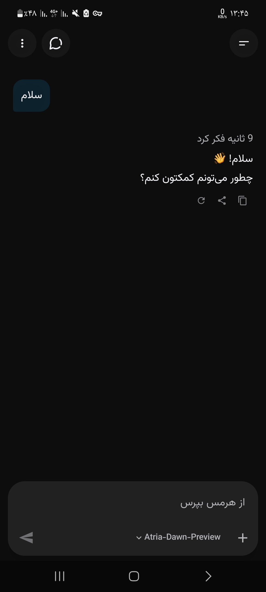
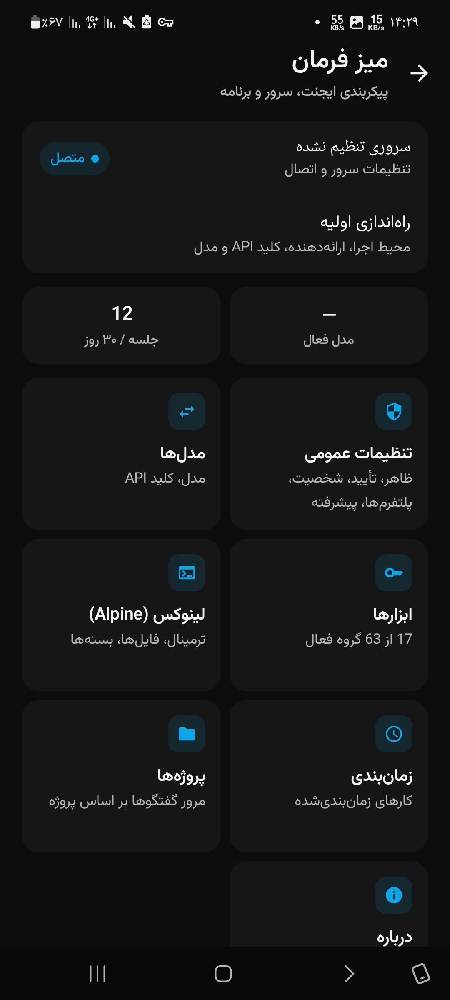

<h1 align="center">⬡ Hermes</h1>

<p align="center" dir="rtl">
  <strong>ایجنت هوش مصنوعی‌ات، روی گوشی خودت.</strong><br>
  خانهٔ نیتیو اندروید برای <a href="https://github.com/NousResearch/hermes-agent">Hermes Agent</a> — بدون سرور، بدون کامپیوتر، بدون نصب چیز دیگر.
</p>

<p align="center">
  <a href="README.md">English</a> •
  <a href="#-امکانات">امکانات</a> •
  <a href="#-شروع-سریع">شروع سریع</a> •
  <a href="#-ساخت-از-سورس">ساخت از سورس</a>
</p>

<p align="center">
  <a href="https://github.com/traveler3022/Hermes-android-termux-/releases/tag/debug-latest"></a>
  <br>
  <a href="https://github.com/traveler3022/Hermes-android-termux-/actions/workflows/build-apk.yml"></a>
  
  <a href="LICENSE"></a>
</p>

<p align="center">
  <table>
    <tr>
      <td></td>
      <td></td>
    </tr>
  </table>
</p>

<div dir="rtl">

---

## ⬡ هرمس

**Hermes** یک ایجنت هوش مصنوعی واقعی رو توی جیبت می‌ذاره. فقط حرف نمی‌زنه — دستور اجرا می‌کنه، کد می‌نویسه و
اجرا می‌کنه، فایل‌ها رو مدیریت می‌کنه، توی وب می‌گرده و کارهای زمان‌بندی‌شده انجام می‌ده؛ همه روی خود گوشی.
اپ رو نصب کن، سرویس هوش مصنوعی‌ات رو انتخاب کن و شروع کن.

تنها چیزی که از گوشی خارج می‌شه، درخواست به سرویس هوش مصنوعی‌ایه که خودت انتخاب کردی. چت‌ها، فایل‌ها و
کلید API روی گوشی می‌مونن — بدون حساب کاربری، بدون ردیابی، بدون سرور ما.

## ✨ امکانات

- **چت تمیز و روان**: پاسخ زنده، نمایش استدلال و کارت ابزارها؛ Markdown، جدول و متن فارسی درست و خوانا.
- **ایجنتی که کار می‌کنه**: دستور اجرا می‌کنه، فایل ویرایش می‌کنه و کد اجرا می‌کنه — و قبل از هر کار حساس ازت تأیید می‌گیره.
- **لینوکس داخلی**: یک محیط لینوکس داخل خود اپ هست و بار اول خودش نصب می‌شه، پس ابزارها از همون اول کار می‌کنن. Termux اختیاریه، نه الزامی.
- **مرورگر و دسکتاپ**: ایجنت Chromium خودش رو روی یک دسکتاپ مجازی کنترل می‌کنه؛ زنده توی اپ تماشا کن و هر وقت خواستی کنترل رو بگیر.
- **ترمینال و فایل‌ها**: ترمینال کامل، و فایل‌های ایجنت مستقیم توی اپ Files اندروید و انتخابگر فایل.
- **کارهای زمان‌بندی‌شده**: فقط بگو *کی* اجرا بشه — لازم نیست cron بلد باشی.
- **گفتگوها و میز فرمان**: جستجو، سنجاق و ادامهٔ چت‌ها؛ مدیریت سرویس‌دهنده، مدل، حافظه، مهارت‌ها، ابزارها و پلاگین‌ها.
- **هر سرویسی**: OpenRouter، Anthropic، OpenAI، Gemini، DeepSeek، Xiaomi MiMo، Z.AI / GLM، Kimi یا هر سرویس سازگار با OpenAI.
- **فارسی + English**، تم روشن و تیره، و کار در پس‌زمینه.

## 🚀 شروع سریع

۱. **[APK رو دانلود کن](https://github.com/traveler3022/Hermes-android-termux-/releases/tag/debug-latest)** و نصبش کن.

۲. Hermes رو باز کن ← **شروع** ← **لینوکس داخلی** ← **نصب Hermes**. تا وقتی خودش رو آماده می‌کنه اپ رو باز نگه دار (فقط یک بار، حدود ۱ گیگابایت فضای خالی و اینترنت پایدار لازمه).

۳. سرویس هوش مصنوعی رو انتخاب کن، کلید API رو وارد کن و مدل رو انتخاب کن.

۴. سلام کن. 👋

**نیازمندی:** اندروید ۱۰ به بالا روی گوشی arm64 یا x86_64.

> [!CAUTION]
> Hermes دستورهای واقعی اجرا می‌کنه. تأیید ابزارها رو روشن نگه دار و کلید API رو هیچ‌وقت توی اسکرین‌شات یا issue نذار.

<details>
<summary><b>رفع مشکل</b></summary>

- **نصب متوقف شد یا خطا داد** — فضا آزاد کن (حداقل ۱ گیگابایت)، اینترنت رو چک کن و دوباره «نصب» رو بزن.
- **با خاموش شدن صفحه ایجنت متوقف می‌شه** — تنظیمات ← برنامه‌ها ← Hermes ← باتری ← **بدون محدودیت**.
- **گزارش باگ** — نسخهٔ اندروید، مدل گوشی و لاگ نصب/اتصال رو بفرست.
</details>

## 🛠 ساخت از سورس

</div>

```bash
git clone https://github.com/traveler3022/Hermes-android-termux-.git
cd Hermes-android-termux-
./gradlew :app:assembleDebug        # APK → app/build/outputs/apk/debug/
./gradlew :app:testDebugUnitTest    # unit tests
```

<div dir="rtl">

JDK 17 و Android SDK 35 لازمه. Kotlin · Jetpack Compose · Material 3 · Hilt · OkHttp.
هر push روی GitHub Actions ساخته می‌شه و در ریلیز [`debug-latest`](https://github.com/traveler3022/Hermes-android-termux-/releases/tag/debug-latest) منتشر می‌شه.

---

## 📄 مجوز

**MIT** — فایل [LICENSE](LICENSE) رو ببین.

</div>

<p align="center" dir="rtl">
  <sub>پروژهٔ مستقل · وابسته به Nous Research نیست · «Hermes Agent» متعلق به سازندگانشه.</sub>
</p>
